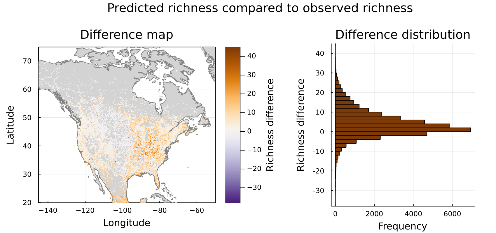
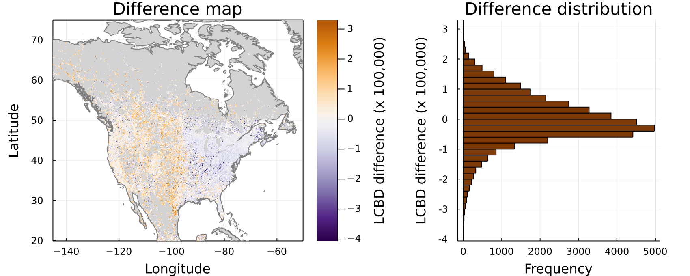
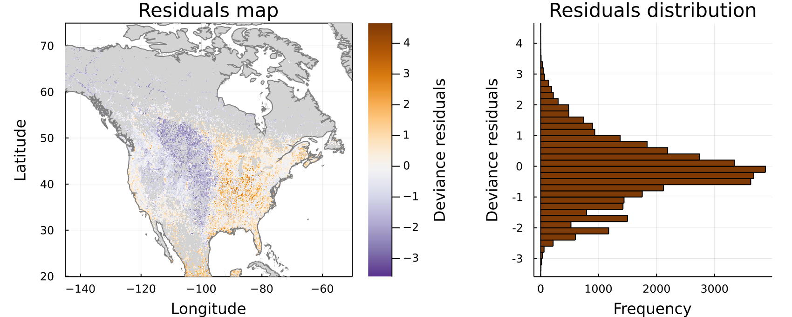
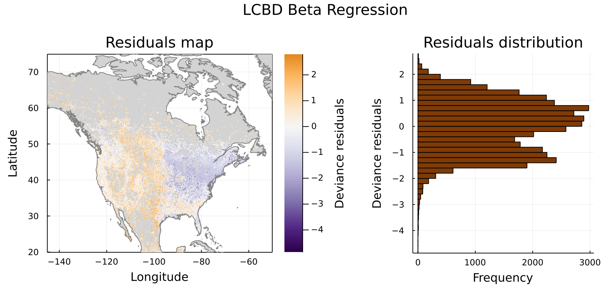
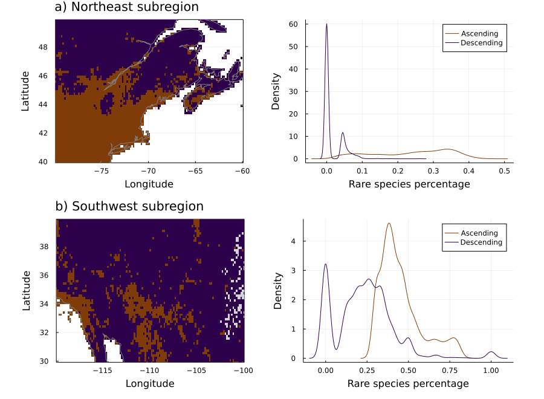

# Introduction

Beta diversity, defined as the variation in species composition among sites in a geographic region of interest [@Legendre2005AnaBet], is an essential measure to describe the organization of biodiversity though space. Total beta diversity within a community can be partitioned into local contributions to beta diversity (LCBD) [@Legendre2013BetDiv], which allows the identification of sites with exceptional species composition, hence unique biodiversity. Such a method, focusing on specific sites, is useful for both community ecology and conservation biology, as it highlights areas that are most important for their research or conservation values. However, the use of LCBD indices is currently limited in two ways. First, LBCD indices are typically used on data collected over local or regional scales with relatively few sites, for example on fish communities at intervals along a river or stream [@Legendre2013BetDiv]. Second, LCBD calculation methods require complete information on community composition, such as a community composition matrix $Y$; thus, they are inappropriate for partially sampled sites (e.g. where data for some species is missing), let alone for unsampled ones. Accordingly, the method is of limited use to identify areas with exceptional biodiversity in regions with sparse sampling. However, predictive approaches are increasingly common given the recent development of computational methods, which often uncover novel ecological insights from existing data [@Poisot2019DatSyn], including in unsampled or lesser-known locations, as well as larger spatial scales. Here, we examine whether the LCBD method can assess ecological uniqueness over broad and continuous scales based on predictions of species distributions and evaluate whether this reveals novel ecological insights regarding the identification of exceptional biodiversity areas.

Species distribution models (SDMs) [@Guisan2005PreSpe] can bring a new perspective to LCBD studies by filling in gaps and performing analyses on much broader scales.  In a community matrix $Y$, such as required for LCBD calculation, ecological communities are abstracted as assemblages of species present at different sites. Viewing communities as such opens the perspective of predicting community composition from predictions of individual species, which is precisely the aim of SDMs. Community-level modelling from SDMs is not an especially novel idea [@Ferrier2002ExtSta; @Ferrier2006SpaMod], but it is increasingly relevant with the advent of large-scale, massive, and open data sources on species occurrences, often contributed by citizens, such as eBird and GBIF. At their core, SDMs aim at predicting the distribution of a species based on information about where the species was previously reported, matched with environmental data at those locations, and then make predictions at other (unsampled) locations based on their respective environmental conditions. However, going from single-species SDMs to a whole community is not a trivial task, and many solutions have been suggested, such as stacked species distribution models (S-SDMs) [@Ferrier2006SpaMod], spatially explicit species assemblage modelling (SESAM) [@Guisan2011SesNew], joint species distribution models (JSDMs) [@Pollock2014UndCoo], and hierarchical modelling of species communities (HMSC) [@Ovaskainen2017HowMak]. These alternative methods all have different strengths, but even S-SDM, in a sense the most simple and less community-specific method, has been shown to provide reliable community predictions [@Norberg2019ComEva; @Zurell2020TesSpe]. This is important, as in the context of large-scale studies with a high number of sites and species, reducing the model complexity with a simpler yet efficient model such as an S-SDM can reduce the number of computations in an important way. Regardless of the method used, community-level analyses can be applied to the resulting community prediction, but this has been lacking for community measures other than species richness [@Ferrier2006SpaMod]. Notably, the LCBD framework has, to our knowledge, never been applied to SDM results. The computation of local contributions to beta diversity (LCBD) on SDM predictions, however, raises the issue of calculating the uniqueness scores on much larger community matrices than on the typical scales on which it has been used. 

The total number of sites will increase (1) because of the continuous scale of the predictions, as there will be more sites in the region of interest than the number of sampled sites, and (2)  because of the larger spatial extent allowed for the SDM predictions. A high number of SDM-predicted sites with a large extent opens up the possibility of capturing a lot of variability of habitats­ and community composition, but also many very similar ones, which could change the way that exceptional sites contribute to the overall variance in the large-scale community. LCBD scores have typically been used at local or regional scales with relatively few sites [@Legendre2013BetDiv; @daSilva2014LocReg; @Heino2017UnrCor; @Heino2017ExpSpe]. Some studies did use the measure over broader, near-continental extents [@Yang2015ComSim; @Poisot2017HosPar; @Taranu2020LarMul], but the total number of sites in these studies was relatively small. Recent studies also investigated LCBD and beta diversity on sites distributed in grids or as pixels of environmental raster layers, hence continuous scales, but these did not cover large extents and a high number of sites [@Tan2017HowBet; @Tan2019UndPro; @Legendre2019SpaTem; @DAntraccoli2020MorSpe]. @Niskanen2017DriHig predicted LCBD values of plant communities (and three other diversity measures) on a continuous scale and a high number of sites (> 25 000) using Boosted Regression Trees (BRTs). However, they modelled the diversity measures directly instead of modelling species distributions first, as we are suggesting here. They obtained lower predictive accuracy for LCBD than for their other diversity measures, mentioning that it highlighted the challenge of predicting LCBD specifically. They also computed LCBD indices at a regional scale, not a continental one, while a using a fine spatial resolution (1 km x 1 km). Therefore, the distribution of LCBD values at broad, continuous scales with a high number of sites and predicted species assemblages remains to be investigated.

Measuring ecological uniqueness from LCBD indices on extended continuous scales also raises the question of which sites will be identified as exceptional and for what reason. The method intends that sites should stand out and receive a high LCBD score whenever they display an exceptional community composition, be it a unique assemblage of species that may have a high conservation value or a richer or poorer community than most in the region [@Legendre2013BetDiv]. Both the original study and many of the later empirical ones have shown a negative relationship between LCBD scores and species richness [@Legendre2013BetDiv; @daSilva2014LocReg; @Heino2017UnrCor; @Heino2017ExpSpe], although other studies observed both negative and positive relationships at different sites [@Kong2017SpaVar] or quadrats [@Yao2021EcoUni]. Therefore, this relationship should still be investigated, especially at broad continuous scales, where LCBD indices have not yet been used. Total beta diversity increases with spatial extent [@Barton2013SpaSca] and is strongly dependent on scale, notably because of higher environmental heterogeneity and sampling of different local species pool [@Heino2015ComAna], which could potentially add some variation to the relationship. Neither the previous studies at broad spatial extents [@Poisot2017HosPar; @Taranu2020LarMul; @Yang2015ComSim], on spatially continuous data [@Tan2019UndPro; @DAntraccoli2020MorSpe], or on a high number of sites [@Niskanen2017DriHig] have specifically measured the variations of the richness-LCBD relationship according to different regions and spatial extents. These studies brought forward relevant elements which now need to be combined.

This study shows that species distribution modelling offers relevant LCBD and community-level predictions on broad spatial scales, similar to those obtained from occurrence data and providing uniqueness assessments in poorly sampled regions. Our results further highlight a changing relationship between site richness and LCBD values depending on (i) the region on which it is used, as species-poor and species-rich regions display different uniqueness profiles; and on (ii) the scale at which it is applied, as increasing the spatial extent can merge the uniqueness profiles of contrasting subregions to create a new, distinct one at a broader scale. Hence, our method could prove useful to identify beta diversity hotspots in unsampled locations on large spatial scales, which could be important targets for conservation purposes.

# Methods

We measured how compositional uniqueness varies on broad continuous scales. We first predicted species composition on continuous scales using extended occurrence data from eBird and species distribution models. We then quantified compositional uniqueness for both predicted and observed data and compared the relationship between uniqueness and richness for different regions and scales. We used _Julia v1.5.3_ [@Bezanson2017JulFre] for most of the project and _R v4.0.2_ [@RCoreTeam2020RLan] for some specific steps. All the scripts used for the analyses are available at <https://github.com/gabrieldansereau/betadiversity-hotspots>.

## Occurrence data

We used occurrence data from eBird [@Sullivan2009EbiCit] downloaded through the eBird Basic Dataset from June 2019 [@eBirdBasicDataset2019VerEbd]. We restricted our analyses to the New World warbler family (_Parulidae_) in North America (Canada, United States, Mexico) using the _R_ package `auk` [@Strimas-Mackey2018AukEbi] to extract and process bird sightings records from the eBird data base. eBird is a semi-structured citizen science data set, meaning that observations are reported as checklists of species detected in an observation run [@Johnston2020AnaGui]. Observers can explicitly specify that their checklist contains all species they could detect and identify during a sampling event, in which case it is labelled as a "complete checklist." Using complete checklists instead of regular checklists allows researchers to infer non-detections in locations where detection efforts did occur, which offers performance gains in species distribution models [@Johnston2020AnaGui]. Therefore, we selected the data from the complete checklists only. Our final data set comprised 62 warbler species and nearly 23 million observations from 9 million checklists. Warblers are a diverse group with a sufficient number of species, are popular among birders given their charismatic aspect, are distributed in diverse areas, and are present relatively everywhere in North America.

We then converted the occurrence data to a presence-absence format compatible with community analyses. We considered every pixel from our ten arc-minutes environmental layers as a site. We then verified, for each species, if there was a single observation in every site. We recorded the outcome as a binary value: present (1) if a species was ever recorded in a site and absent (0) if it was not. Complete checklists ensure that these zeros hopefully represent non-detections, rather than the species not being reported; hence we considered them as absence data, similar to @Johnston2020AnaGui.

## Environmental data

Our environmental data consisted of climatic data from the WorldClim 2.1 data base [@Fick2017Wor2N] and land cover data from the Copernicus Global Land Service [@Buchhorn2019CopGlo]. We restricted these data to a spatial extent comprised between -145.0 and -50.0 degrees of longitude and between 20.0 and 75.0 degrees of latitude ([@Fig:maps]). The WorldClim data consists of spatially interpolated monthly climate data for global land areas. We downloaded the data at a resolution of 10 arc-minutes (around 18 km² at the equator), the coarsest resolution available, using the _Julia_ package `SimpleSDMLayers.jl` [@Dansereau2021SimJl]. The coarse resolution should mitigate potential imprecisions in the eBird data regarding the extent of the sampled areas in each observation checklist. Moreover, some studies have argued that coarser resolutions lead to less overestimation of species richness and better identification of bird biodiversity hotspots given the patchiness of observation data [@Hurlbert2007SpeRic]. We used the standard _bioClim_ variables from WorldClim 2.1, which represent annual trends, ranges, and extremes of temperature and precipitation, but selected only 8 out of the 19 ones to avoid redundancy (bio1, bio2, bio5, bio6, bio12, bio13, bio14, bio15). The Copernicus data is a set of variables representing ten land cover classes (e.g. crops, trees, urban areas) and measured as a percentage of land cover. The data is only available at a finer resolution of 100 m, which we downloaded directly from the website. We coarsened it to the same ten arc-minutes resolution as the WorldClim data by averaging the pixels' cover fraction values with `GDAL` [@GDAL/OGRcontributors2021GdaOgr]. We first selected the ten land cover variables but later removed two (moss and snow) from our predictive models. Their cover fraction was 0% on all sites with warbler observations; hence they did not provide any predictive value to our SDM models.

## Species distribution models

We predicted species distribution data on continuous scales from our presence-absence data using Bayesian Additive Regression Trees (BARTs) [@Chipman2010BarBay], a classification and regression trees method recently suggested for species distribution modelling [@Carlson2020EmbSpe]. BARTs are sum-of-trees models, conceptually similar to Boosted Regression Trees and Random Forest, but following a Bayesian paradigm: trees are constrained as weak learners by priors regarding structure and nodes [@Chipman2010BarBay; @Carlson2020EmbSpe]. Then, fitting and inference is made through an iterative Bayesian backfitting MCMC algorithm generating a posterior distribution of predicted classification probabilities [@Chipman2010BarBay; @Carlson2020EmbSpe]. We used the package `embarcadero` [@Carlson2020EmbSpe] in _R_ to compute the BART models. We performed BARTs separately for all species and estimated the probability of occurrence for all the sites in in the pseudo-rectangular spatial units of 10 arc-minutes in the region of interest. We then converted the results to a binary outcome according to the threshold that maximized the True Skill Statistic (TSS) for each species, as suggested by @Carlson2020EmbSpe. 

## Quantification of ecological uniqueness

We used the method of @Legendre2013BetDiv to quantify compositional uniqueness from overall beta diversity for both the observed and predicted data. First, we assembled the presence-absence data by site to form two site-by-species community matrices, one from observed data, called $Y$ (39,091 sites by 62 species), and one from predicted data, called $\hat Y$ (99,609 sites by 62 species). We measured species richness per site as the sum of the presences in each row, i.e. the number of species present. We removed the sites without any species from the predicted community matrix $\hat Y$, for a new total of 92,117 sites (this was not necessary for the observed community matrix $Y$, as it was, by design, only composed of sites with at least one species present). We applied the Hellinger transformation to both matrices, as recommended by @Legendre2013BetDiv for presence-absence data. We then measured total beta diversity as the variance of the community matrices and calculated the local contributions to beta diversity (LCBD), which quantify how much a specific site (a row in each matrix) contributes to the overall variance in the community [@Legendre2013BetDiv]. High LCBD values indicate a unique community composition, while low values indicate a more common species set. Measuring beta diversity as the variance of the community matrices offers a critical advantage in computations in this case, as alternative approaches based on sites' pairwise dissimilarity would require a much higher number of calculations given the high number of sites in our study. We note that our LCBD values, which add up to 1 because the raw LCBD values are divided by the total sum-of-squares of the data matrix, were very low given the high number of sites in both $Y$ and $\hat Y$. However, the relative difference between the scores matters more than the absolute value to differentiate their uniqueness.

## Comparison of observed and predicted values

We performed three verifications in order to compare the species richness and uniqueness estimates obtained from our predicted species distributions to the ones obtained with the occurrence data from eBird. First, we performed a direct comparison by subtracting the richness and LCBD estimates obtained from $Y$ (the observed data) from the estimates obtained from $\hat{Y}$ (the predicted data). To do so, we used the richness estimates as-is, but modified the LCBD values to achieve a non biased comparison, given that the original values are calculated for the same sites, but on sets of different length. We therefore recomputed the LCBD scores only for the sites for which we had occurrences in both $Y$ and $\hat{Y}$, which mostly corresponded to the sites in $Y$, minus a few sites where the SDMs predict no species occurrence. We then plotted the richness and LCBD differences to examine their spatial distributions. Second, we performed the modified _t_ test from @Clifford1989AssSig to assess the correlation between the observed and predicted estimates and test for spatial autocorrelation. We performed the test separately for the richness and the LCBD estimates. We used the `modified.ttest` function from the package `SpatialPack` [@Vallejos2020SpaRel] in _R_.Third, we performed Generalized Linear Models between the observed and predicted estimates and plotted the residuals to examine their spatial distribution. We used a negative binomial regression with a log link function using the package `MASS` [@Venables2002ModApp] in _R_ for the richness estimates as our values showed overdispersion. We used a beta regression with a logit link function using the package `betareg` [@Cribari-Neto2010BetReg] for the LCBD values as they vary between 0 and 1, similar to @Heino2017ExpSpe and @Yao2021EcoUni.

## Investigation of regional and scaling variation

We recalculated LCBD values on various subregions at different locations and scales to investigate possible regional and scaling effects. First, we selected two subregions of equivalent sizes (20.0 longitude degrees by 10.0 latitude degrees) with two contrasting richness profiles to verify if the relationship between species richness and LCBD values was similar. We selected a Northeast subregion (longitude between -80.0 and -60.0, latitude between 40.0 and 50.0), mostly species-rich, and a Southwest subregion (longitude between -120.0 and 100.0, latitude between 30.0 and 40.0), mostly species-poor (for both the observed and predicted data). @Fig:subareas shows the coordinates and spatial extents of both subregions. Second, we recalculated the LCBD indices at three different extents, starting with a focus on the Northeast subregion and progressively extending the extent to encompass the Southwest subregion ([@Fig:3scales]). These are conceptually similar to the spatial windows of @Barton2013SpaSca, which allow one to study the variation of beta diversity according to spatial extent. We did these two verifications with both the observed and predicted data but only illustrate the results with the predicted data as both were qualitatively similar.

## Proportion of rare species

We investigated the effect of the proportion of rare species in the community on the direction of the relationship between species richness and LCBD values in our Northeast and Southwest subregions. Following @DeCaceres2012VarTre and @Yao2021EcoUni, we classified species as rare when they occurred in less than 40% of the sites in each subregion. We calculated the proportion of rare species for every site. For both subregions, we then grouped the sites depending on whether they were part of an ascending or a descending portion in the LCBD-richness relationship. Given that the relationship sometimes displays a curvilinear form with a positive quadratic term [@Heino2017ExpSpe; @Tan2019UndPro], we separated the ascending and descending portions based on the species richness at the site with the lowest LCBD value (we used the median richness if there were multiple sites with the lowest LCBD value), which corresponds to the inflection point of the relationships shown on @Fig:subareas. For example, the lowest LCBD value was 7.032e-5 in the Northeast subregion and the median richness (as there were multiple sites with this LCBD value) was 23. All the sites with more than 23 species were assigned to the ascending portion and all the sites with 23 species or fewer were assigned to the descending portion. In the Southwest subregion, the lowest LCBD value and its corresponding (median) richness were 6.035e-5 and 12, respectively. We then mapped the ascending and descending groups to view their spatial distribution. We also examined the distribution of the rare species proportions in both groups using a density plot. Similar to our previous verifications, we performed this analysis with both observed and predicted data but once again only illustrate the results with the predicted data as both were qualitatively similar.

# Results

## Species distribution models generate relevant community predictions

The species distribution models generated richness and uniqueness results that matched those from observed data, comforting their potential to fill in gaps in poorly sampled regions ([@Fig:maps]). Species richness from observation data ([@Fig:maps]a) was higher on the East coast and lower on the West coast, with many unsampled patches in the North, Midwest, and Southwest. Richness results from SDM data ([@Fig:maps]b) filled in most of the gaps while still displaying higher richness on the East coast and sites with few or no species up North and in the Midwest. There was no clear latitudinal gradient in richness, but rather an East-West one. Landmarks such as the Rockies and croplands in the Midwest (which should be species-poor habitats) were notably visible on the maps, separating the East and West. LCBD scores from observation data ([@Fig:maps]c) were low on the East Coast and higher on the border of sampled sites in the Midwest. They were also higher in the North and in the South ([@Fig:maps]d), where observations were more sparse. Results from SDM predictions were similar, with lower LCBD values in the East and more unique sites in the Midwest region, Central Mexico, and some Northern regions. There was no clear latitudinal gradient once again and the East-West contrast, while present, was less clear than on the richness maps. LCBD values ranged between 1.444e-5 and 5.860e-5 for observation data and between 5.788e-6 and 1.706e-5 for SDM data. The total beta diversity was 0.608 for the observation data and 0.775 for the SDM data.

![Comparison of species richness and LCBD scores from observed and predicted warbler occurrences in North America. Values were calculated for sites representing ten arc-minutes pixels.  We measured species richness after converting the occurrence data from eBird (a) and the SDM predictions from our single-species BART models (b) to a presence-absence format per species. We applied the Hellinger transformation to the presence-absence data, then calculated the LCBD values from the variance of the community matrices. We scaled the LCBD values from the occurrence data (c) and SDM predictions (d) to their respective maximal value. LCBD values ranged between 1.444e-5 and 5.860e-5 for observation data and between 5.788e-6 and 1.706e-5 for SDM data. The total beta diversity was 0.608 for the observation data and 0.775 for the SDM data. Areas in light grey (not on the colour scale) represent mainland sites with environmental data but without any warbler species present.](figures/combined-maps.png){#fig:maps}

{#fig:comparison-richness}

{#fig:comparison-lcbd}

{#fig:residuals-richness}

{#fig:residuals-lcbd}

## Uniqueness displays regional variation as two distinct profiles

The relationship between LCBD values and species richness displayed two contrasting profiles in species-rich and species-poor regions ([@Fig:subareas]). In the species-rich Northeastern region of our study extent (North America), LCBD scores displayed a decreasing relationship with species richness. Hence, the sites with the highest LCBD values, i.e. the unique ones in terms of species composition, were the species-poor sites, while the species-rich sites displayed lower LCBD scores. Therefore, our results show that the only way for a site to stand out and "be exceptional" in such a region is to have few species. Since most sites in the Northeastern region comprise 20 to 30 warbler species, the richest ones with 40 species do not stand out and are not as exceptional as those with 10 species or fewer. The Southwest subarea, on the other hand, showed a different relationship. While the sites with the highest LCBD values were once again the poorest ones in terms of species richness, the decreasing relationship with richness was initially much sharper and displayed a more significant increase as richness reaches 20 species. Since most sites comprised around 10 species and few ones more than 20, sites with 40 species stand out more and are more exceptional in such species-poor regions than they would be in species-rich ones. Total beta diversity was also higher in the Southwest subregion (0.441) than in the Northeast one (0.176), indicating higher compositional differences between the sites. LCBD values ranged between 7.032e-5 and 1.333e-3 for the Northeast subregion and between 6.035e-5 and 5.236e-4 for the Southwest one.

![Comparison between a species-rich region (Northeast) and a species-poor one (Southwest) at a given scale based on the SDM predictions for warbler species in North America. The richness-LCBD relationship displayed contrasting profiles for the subregions according to their general richness. Total beta diversity was higher in the Southwest subregion than in the Northeast one. The left-side figures represent the assembled presence-absence prediction scores, calculated separately in each region after applying the Hellinger transformation. The values were scaled to the maximum LCBD observed in each subregion. The right-side figures represent the decreasing relationship between LCBD values and species richness, with the number of sites in the bins of the 2-dimensional histogram. The vertical and horizontal dashed lines respectively represent the median richness and LCBD value in each region. LCBD values ranged between 7.032e-5 and 1.333e-3 for the Northeast subregion and between 6.035e-5 and 5.236e-4 for the Southwest one.](figures/subareas-combined.png){#fig:subareas}

## Uniqueness depends on the scale on which it is measured

The LCBD-richness relationship showed some important variation when scaling up and changing the region's study extent ([@Fig:3scales]). For smaller extents, starting with a species-rich region, the relationship is well-defined, decreasing, and curvilinear. However, as the scale increases and progressively reaches species-poor regions, the relationship broadens, displays more variance, and loses its clear definition while keeping a decreasing form. Total beta diversity was higher when increasing the spatial extent, going from 0.116 to 0.279 to 0.682. LCBD values ranged between 2.195e-4 and 5.209e-3 at the finest scale, between 1.478e-4 and 3.500e-3 at the intermediate one, and between 1.179e-05 and 5.218e-05 at the broadest one.

![Effect of scaling and full region extent size on the relationship between site richness and LCBD value from the SDM predictions for warbler species in North America. The relationship progressively broadens and displays more variance when scaling while total beta diversity increases. The LCBD values were recalculated at each scale based on the sites in this region and then were scaled to the maximum value in each region. LCBD values ranged between 2.195e-4 and 5.209e-3 at the finest scale, between 1.478e-4 and 3.500e-3 at the intermediate one, and between 1.179e-05 and 5.218e-05 at the broadest one. The vertical and horizontal dashed lines respectively represent the median richness and LCBD value in each region.](figures/subareas-3scales.png){#fig:3scales}

## Uniqueness depends on the proportion of rare species

{#fig:rarespecies}

# Discussion

Our results showed a decreasing relationship between species richness and LCBD values on broad continuous scales but also highlighted that the exact form of this relationship varies depending on the region and the spatial extent on which it is measured. Our species-rich Northeast subregion ([@Fig:subareas]) showed a decreasing relationship, very similar to previous studies, and slightly curvilinear, as described by @Heino2017ExpSpe. This result for warbler species is in line with the original study on fish communities [@Legendre2013BetDiv] and with following ones on insect metacommunities [@daSilva2014LocReg; @Heino2017UnrCor; @Heino2017ExpSpe], dung beetles [@daSilva2018DisCor; @daSilva2020CanTax], aquatic beetles [@Heino2019KniPat], stream macroinvertebrates [@Sor2018UniSam], stream diatoms [@Vilmi2017EcoUni], multi-trophic pelagic food webs (phytoplankton, zooplankton, fish) [@Taranu2020LarMul], temperate forest trees [@Tan2019UndPro], mammals (medium-to-large, small, volant) [@daSilva2020CanTax], wetland birds [@deDeus2020AviBet], and a few other phylogenetic groups (plants, lizards, mites, anurans, mesoinvertebrates) [@Landeiro2018SpeLow]. The slightly curvilinear form was also found in different studies [@Heino2017ExpSpe; @Tan2019UndPro]. However, it was originally argued that the negative relationship was not general or obligatory [@Legendre2013BetDiv]. Different LCBD-richness relationships have also been observed, with both positive and negative relationships for different sites or taxonomic groups in some studies [@Kong2017SpaVar; @Teittinen2017LocGeo], as well as a negative relationship with the number of common species but a positive relationship with the number of rare species [@Qiao2015BetDiv]. This led @daSilva2018DisCor to say that the proportion of rare and common species in the communities seems to determine if the relationship will be negative, non-significant, or positive. Our results further show that the relationship may depend on the region's richness profile, as the relationship was different in our species-poor Southwest subregion, with a sharper initial decrease in contribution for medium-rich sites and a higher contribution for highly rich ones.

The regional variation in the relationship between species richness and LCBD scores shows that the LCBD method may identify unique sites based on different characteristics depending on the region for which it is used. Comparative studies have previously found a significant relationship between presence-absence LCBD values and richness, but not between abundance LCBD values and richness [@daSilva2014LocReg; @Heino2017ExpSpe]. In a presence-absence context, our results tend to confirm that species richness is probably the most important element to determine the LCBD value. In a species-rich region, such as our Northeast one (median richness of 23), the only way to stand out is to have few species. On the other hand, in a species-poor region, sites with higher richness can also be unique, yet still less than the sites with the lowest richness. In other words, the method identifies the poorest sites as the most unique in both species-rich and species-poor regions while only identifying rich sites as unique in the species-poor region. Extremely-rich sites could, in theory, have high LCBD values, but such sites may be rare given ecological constraints and species niche preferences. It is unlikely that all species present at the regional level would cohabit in a single site given their different niche requirements. However, on presence-absence data, the number of species present is the only way to introduce variance (while on abundance data, the variation could come from the species counts). Therefore, the curvilinear form may depend on how big the contrast will be between the region's median richness and its richest ecologically possible sites.

The variation in the LCBD-richness relationship when scaling up and changing the overall study extent shows that the uniqueness patterns highlighted are not necessarily the same depending on the scale on which it is used. The subregions' uniqueness profiles will merge at broad spatial scales, but this can create a new profile with a lot more variation. When too many poor sites are present, rich sites will almost certainly have lower LCBD values. Aggregating too many different sites might then possibly mask some patterns of uniqueness. Total beta diversity, on the other hand, showed the variation expected from previous studies, increasing with spatial extent ([@Fig:3scales]) [@Barton2013SpaSca; @Heino2015ComAna]. Its value was high at the continental scale (0.628) but lower than what has been observed in some studies (e.g. 0.80 in @Sor2018UniSam).

Our results show that SDM models provide uniqueness predictions similar to the occurrence data while filling gaps in poorly sampled regions. This is of interest as it allows for a quantitative evaluation, however imperfect, for sites where we would otherwise have no information. Our SDMs also offered relevant LCBD predictions using eBird, arguably one the largest presence-absence data sets available (when using its complete checklists system), and showed the measure's potential on such massive data. Moreover, our results showed that relevant community-level predictions could be achieved using simple stacked-SDMs. These two elements open up new opportunities for LCBD analyses on extended spatial scales, as well as for the diversity of taxons to which this type of analysis can be applied. At the coarse spatial resolution we used, there is also evidence of a spatial smoothing effect caused by the SDMs: New-England and the Northeast United States show more uniform richness and uniqueness values on the SDM data than on the observed one. Given that we used a very coarse spatial resolution, this shows that SDMs may overcome some large-scale bias in the occurrence data, notably around cities. It also shows that the LCBD method can highlight unique regions more than unique sites on extended continuous scales or highlight regional rather than site differences. This is in contrast to @Heino2017UnrCor, who found no spatial effect regarding LCBD or richness, although this was in a totally different context -- insect communities in discrete urban ponds, whereas our models on continuous scales with mobile species intend to capture dispersal between sites -- but in line with @daSilva2018DisCor, who showed that LCBD distributions were spatially structured across sampling sites. @Landeiro2018SpeLow showed that uniqueness is more associated with environmental conditions than with spatial positioning, which would concord with our results given that our SDMs only used environmental data. Our results do not concord exactly with those of @Heino2019KniPat, as LCBD scores did not increase with latitude but rather increased in an East-West gradient. Overall, these distribution results have implications for conservation, as they confirm that species richness and ecological uniqueness measured from LCBD values may conflict and highlight different potential hotspots [@Dubois2020EcoUni; @Yao2021EcoUni], thus reinstating the need to protect both with complementary strategies.

This study shows how ecological uniqueness can be measured on broad continuous map extents when portions of the maps contain few or no observational data.. First, the negative relationship often observed between species richness and local contributions to beta diversity (LCBD) can take different forms depending on the richness profile of the regions on which it is measured. Therefore, species-rich and species-poor regions may display different ways to be unique. Second, the negative relationship is not constant when varying the spatial study extent and may be less clearly defined at broad scales when contrasting regional relationships are present. Finally, species distribution models (SDMs) offer a promising way to generate uniqueness predictions on broad and continuous scales that match observation data while providing new information for poorly or unsampled locations.

# Acknowledgments

We acknowledge that this study was conducted on land within the traditional unceded territory of the Saint Lawrence Iroquoian, Anishinabewaki, Mohawk, Huron-Wendat, and Omàmiwininiwak nations. We have received financial support from the Fonds de recherche du Québec - Nature et technologie (FRQNT) and the Computational Biodiversity Science and Services (BIOS²) NSERC CREATE training program.

# References
